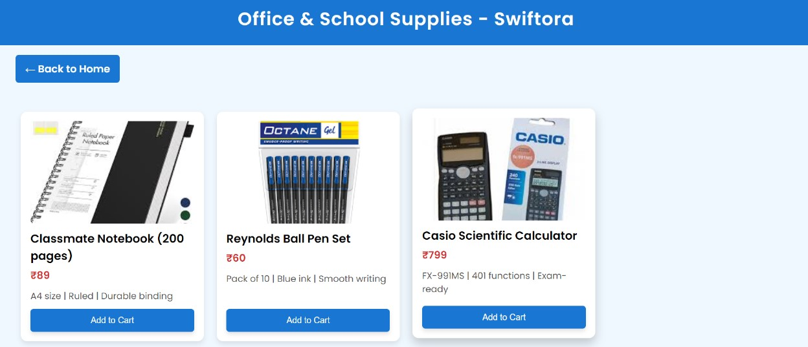
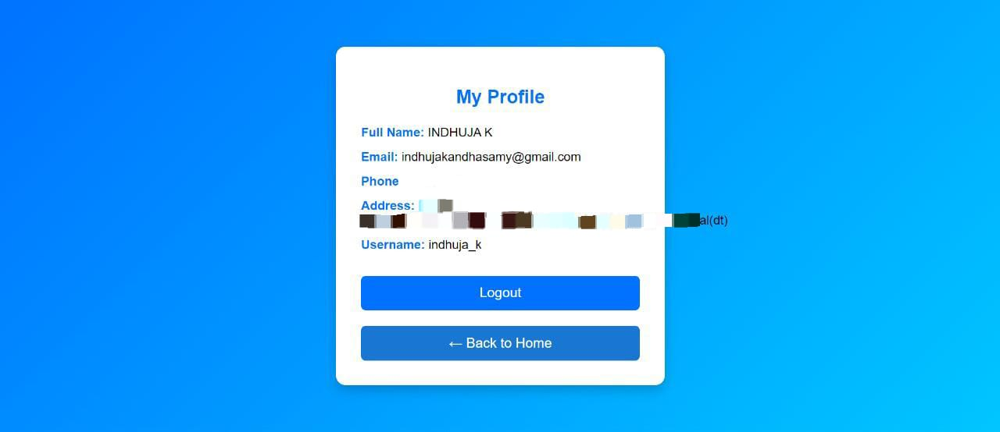
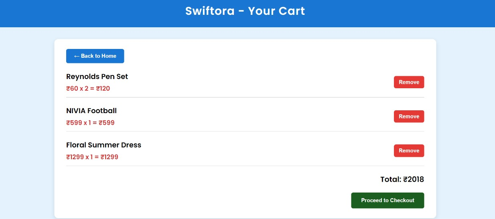

# 🛍 Swiftora E-Commerce Web UI

Swiftora is an e-commerce website that lets users browse products by category and manage a shopping cart. It includes basic features like category pages, search, cart storage using localStorage, and navigation between pages.

---

## ✨ Features

- Responsive and mobile-friendly design
- Category-based navigation (Books, Toys, Electronics, etc.)
- Add to Cart functionality using localStorage
- Profile page with saved user info
- Forgot password flow (localStorage-based)
- Animated hover effects and modern UI
- Smooth search filtering by category name

---

## 🛠 Technologies Used

- HTML5
- CSS3 (with custom responsive styles)
- JavaScript (Vanilla JS, DOM + localStorage)
- VS Code for development

---

## 🚀 Run Locally

1. Clone the repository:
   git clone https://github.com/indhuja-k/swiftora.git

2. Navigate to the project directory:
   cd swiftora

3. Open the project in your browser:
   Just open index.html from the root folder
   OR use a local server:

   For Python 3:
   python -m http.server

4. Open browser and go to:
   http://localhost:8000

---

## 📸 Screenshots

| Home Page | Office & School supplies | Profile Page | Cart page |
|-----------|----------------|--------------|------------------|
|  |  |  |  |

---

👥 Contributors
<table> <tr> <td align="center"> <a href="https://github.com/Indhuja-k">    <b>INDHUJA K</b> </a>   💻 💡 🎨 </td> <!-- Add more contributors below this line --> </tr> </table>
